## Домашнє завдання до теми «Apache Spark. Оптимізація та SparkUІ»

### Частина 1

#### Job list 1

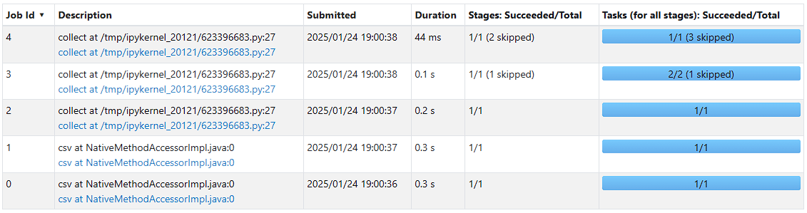

**Job 0**

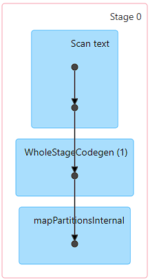

**Job 1**

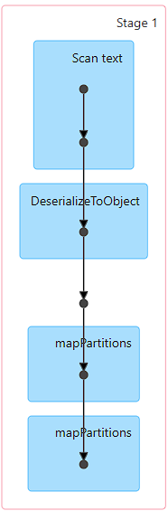

**Job 2**

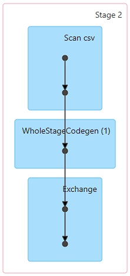

**Job 3**

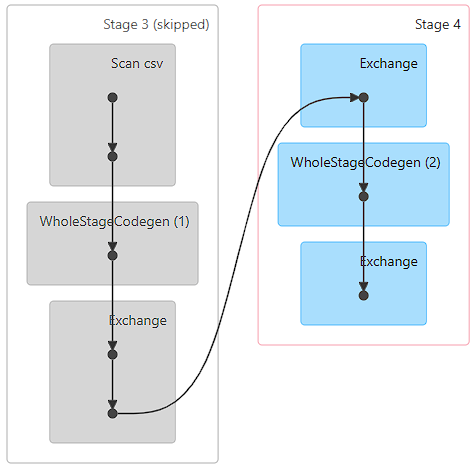

**Job 4**

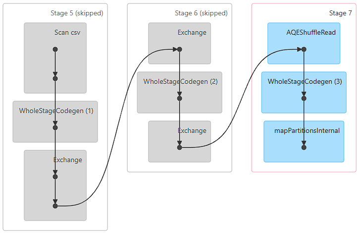

Ми очікувано бачимо перші 2 джоби це завантаження і десереалізація файлу.

Далі ще 3 джоби без повторень, адже у нас в коді лиш одна операція дії `collect()` (пам'ятаємо, що `count()` після `groupby` - це теж трансформація).

### Частина 2

#### Job list 2

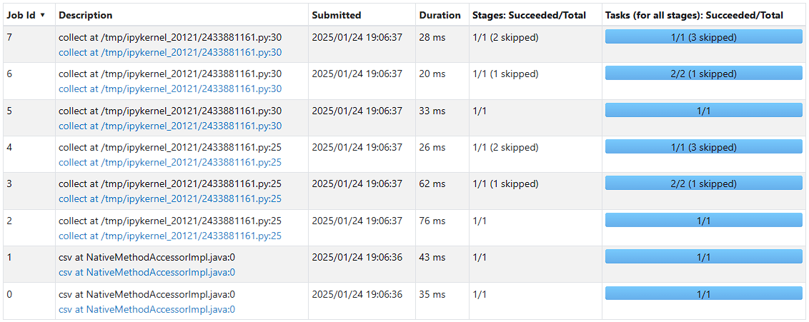

**Job 0**

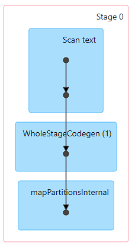

**Job 1**

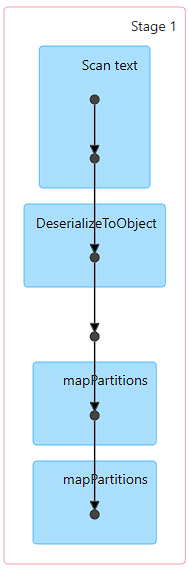

**Job 2**

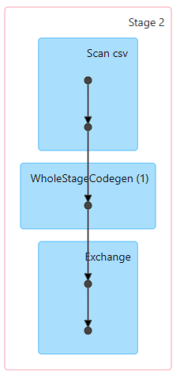

**Job 3**

**Job 4**

**Job 5**

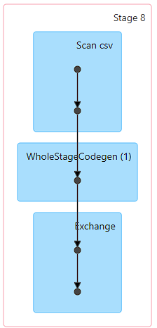

**Job 6**

**Job 7**

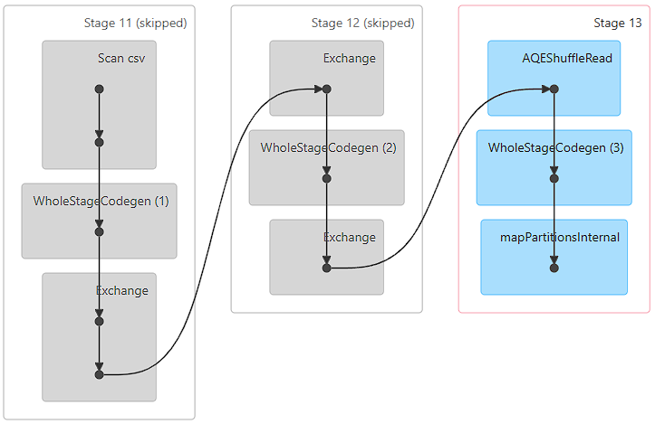

Знову, очікувано бачимо перші 2 джоби це завантаження і десереалізація файлу.

Далі ще 3 джоби що виконують проміжну дію `collect()`.

Потім у нас додається ще одна команда трансформації `where("count>2")` і друга команда дії `collect()`, але ця дія виконується з самого початку, тому ми бачимо знову 3 джоби.

### Частина 3

#### Job list 3

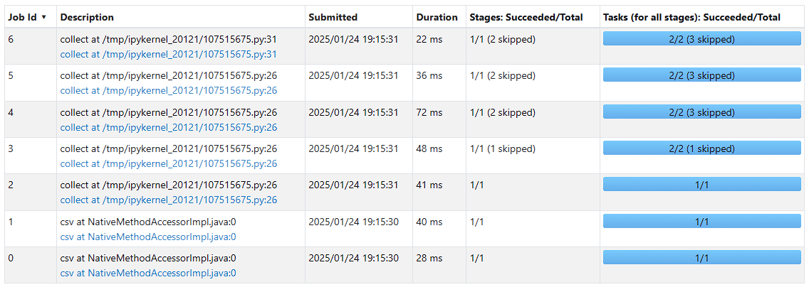

**Job 0**

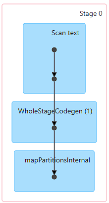

**Job 1**

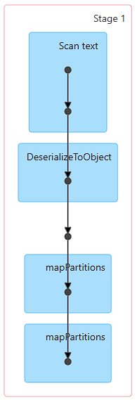

**Job 2**

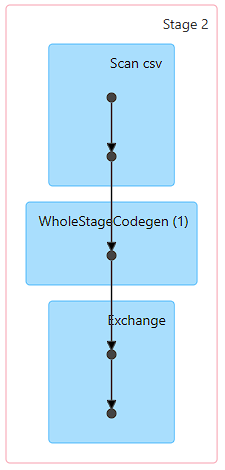

**Job 3**

**Job 4**

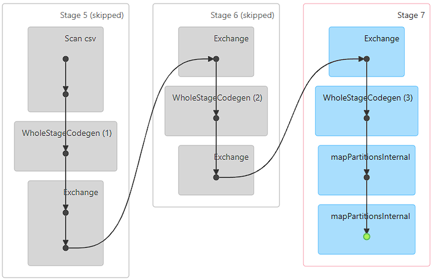

**Job 5**

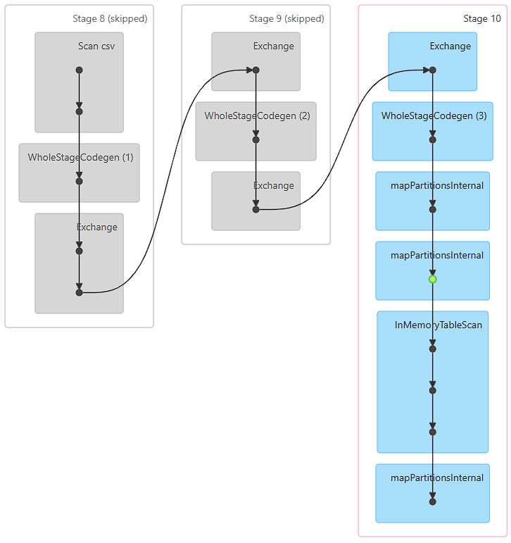

**Job 6**

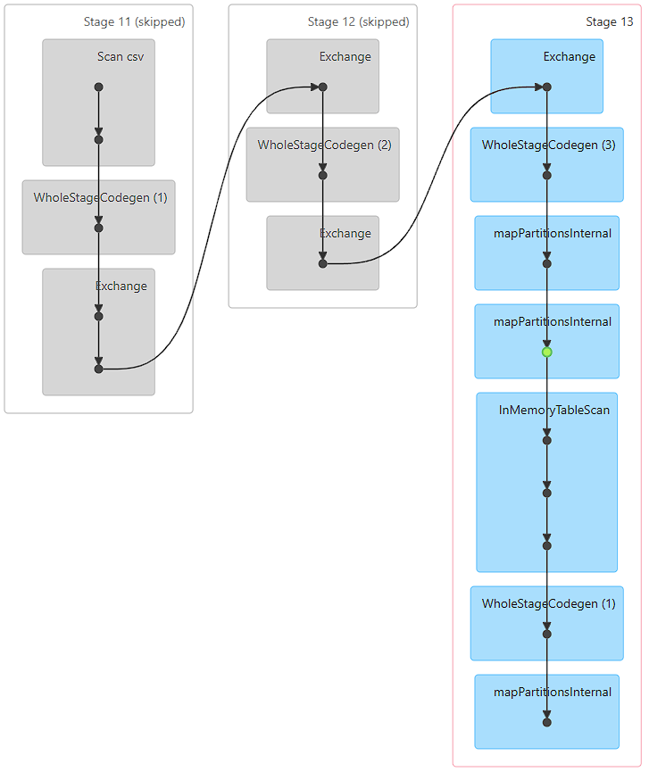

Як і раніше, бачимо перші 2 джоби - це завантаження і десереалізація файлу.

Далі бачимо 4 джоби що виконують проміжну дію `collect()` і в цей час фіксуємо проміжний результат в пам'яті, (команда `cache()`). Таким чином на даному етапі ми в пам'яті маємо "чекпоінт", і всі наступні дії що виконуються з поточним станом датафрейму будуть починатися не з початку, а саме з цієї точки.

Потім у нас додається ще одна команда трансформації `where("count>2")` і друга команда дії `collect()`, але оскільки у нас є закешований запис, то ця дія виконується не з самого початку і ми бачимо лиш одну додаткову джобу.